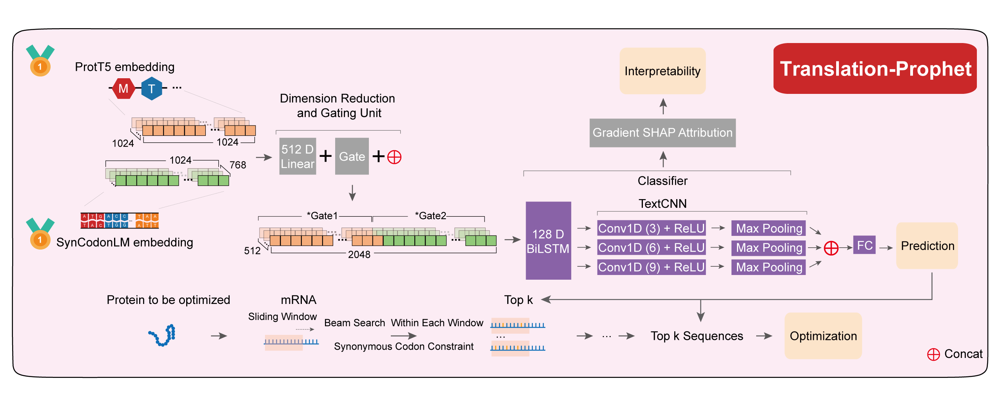

# Translation-Prophet

Translation-Prophet is a kinetic-aware translational framework that links translational kinetics to protein phenotypes across diverse applications. It enables accurate prediction, mechanistic interpretation, and synonymous codon sequence optimization. This repository provides pretrained Translation-Prophet model weights for predictive modeling and optimization of protein solubility in *Escherichia coli* (*E. coli*), along with flexible training scripts that can be readily adapted to other protein-related tasks.

<p align="center">
  
</p>

### Key Features

* **Robust predictive performance**: Delivers consistently high accuracy across datasets, proteins, and experimental settings.

* **Multi-level interpretability**: Provides insights at the codon- and amino acid-level to reveal underlying biological mechanisms.

* **Model-guided synonymous codon optimization**: Enables rational enhancement of protein-related phenotypes through informed synonymous codon design, such as protein solubility.

* **Cross-species and task generalization**: Maintains strong and stable performance across multiple species and diverse protein-related tasks.

  

## 🛠️ System Requirements

Translation-Prophet is built on Python and PyTorch. We recommend running on a Linux environment with CUDA support.

* **GPU**: NVIDIA GPU (RTX 3090 or higher recommended for embedding and training)


## 📦 Installation

```bash
# 1. Clone the repository
git clone https://github.com/Wu-BioAI/Translation-Prophet
cd Translation-Prophet

# 2. Create Conda environment
conda env create -f environment.yml -n TP
conda activate TP
pip install torch==2.6.0 torchvision==0.21.0 torchaudio==2.6.0 --index-url https://download.pytorch.org/whl/cu124

# 3. Download embedding model weights
pip install huggingface-hub
python scripts/download_embedding_model.py

```

Alternatively, users may manually download the corresponding model files from Hugging Face and place them into the following directories:

```
embedding_model/
├── SynCodonML/
└── ProtT5/
```

### ⚠️ Important Notice！！！

When using the pretrained model weights provided in this repository, it is essential to **download the exact versions** of the embedding models specified in `scripts/download_embedding_model.py`. In particular, **SynCodonLM was trained and evaluated using an earlier model revision**, and using a newer version may lead to **incompatible embeddings and degraded performance**. If you intend to train Translation-Prophet on new tasks or datasets, you may choose to use newer versions of the embedding models.


## 📖Usage

Translation-Prophet is accessed through a unified command-line interface (CLI).

```bash
# Before running the CLI
pip install -e .

#  The general syntax
tp <mode> [options]

tp embedding        # Extract sequence embeddings
tp train            # Train task-specific models
tp predict          # Run inference with trained models
tp interpret        # Perform multi-level interpretability analysis
tp optimize-codon   # Synonymous codon optimization
```


### 1.Minimal  Quick  Start 

```bash
############################################
# Environment setup
############################################
# Create conda environment and install dependencies
conda env create -f environment.yml -n TP
conda activate TP

# Install PyTorch with CUDA support
pip install torch==2.6.0 torchvision==0.21.0 torchaudio==2.6.0 \
  --index-url https://download.pytorch.org/whl/cu124

# Download pretrained embedding models
python scripts/download_embedding_model.py

# Install TP in editable mode
pip install -e .

# Download `test_dataset.pt` from Zenodo (DOI: 10.5281/zenodo.18502006)
# and place it under: dataset/GradientShap_baseline/


############################################
# Embedding generation
############################################
# ProtT5 embedding (amino-acid–level)
tp embedding \
  --mode protT5 \
  --pos_fasta test_dataset/test1.fasta \
  --neg_fasta test_dataset/test0.fasta \
  --model_dir embedding_model/ProtT5 \
  --out_dir temp/embedding_out/ProtT5

# SynCodonLM embedding (codon-level)
tp embedding \
  --mode syncodonlm \
  --pos_fasta test_dataset/test1.fasta \
  --neg_fasta test_dataset/test0.fasta \
  --model_dir embedding_model/SynCodonLM \
  --out_dir temp/embedding_out/SynCodonLM


############################################
# Model training (custom protein task)
############################################
tp train \
  --task your_task \
  --protT5_dir temp/embedding_out/ProtT5 \
  --syncodonlm_dir temp/embedding_out/SynCodonLM \
  --out_dir temp/model


############################################
# Prediction using pretrained E. coli solubility model
############################################
tp predict \
  --protT5_dir temp/embedding_out/ProtT5 \
  --syncodonlm_dir temp/embedding_out/SynCodonLM \
  --model_file model/best_model_0.pth \
  --out_dir temp/prediction


############################################
# Model interpretation
############################################
# Re-generate embeddings for interpretation
tp embedding \
  --mode protT5 \
  --pos_fasta test_dataset/seq_test1.fasta \
  --neg_fasta test_dataset/seq_test0.fasta \
  --model_dir embedding_model/ProtT5 \
  --out_dir temp/embedding_out/ProtT5_2

tp embedding \
  --mode syncodonlm \
  --pos_fasta test_dataset/seq_test1.fasta \
  --neg_fasta test_dataset/seq_test0.fasta \
  --model_dir embedding_model/SynCodonLM \
  --out_dir temp/embedding_out/SynCodonLM_2

# Attribution analysis
tp interpret \
  --protT5_dir temp/embedding_out/ProtT5_2 \
  --syncodonlm_dir temp/embedding_out/SynCodonLM_2 \
  --model_file model/best_model_0.pth \
  --out_dir temp/interpret


############################################
# Codon optimization
############################################
tp optimize_codon \
  --raw_fasta test_dataset/seq_test0.fasta \
  --model_file model/best_model_0.pth \
  --out_dir temp/optimize \
  --window_size 3 \
  --step_size 3 \
  --k 1
```


### 2.tp embedding

Extract sequence embeddings using pretrained language models (ProtT5 or SynCodonLM).

```bash
tp embedding --help

usage: tp [-h] --mode {protT5,syncodonlm} --pos_fasta POS_FASTA --neg_fasta NEG_FASTA --model_dir MODEL_DIR --out_dir OUT_DIR
          [--batch_size BATCH_SIZE] [--max_length MAX_LENGTH] [--token_type_id TOKEN_TYPE_ID] [--gpu GPU]

Extract embeddings from ProtT5 or SynCodonLM

optional arguments:
  -h, --help            show this help message and exit
  --mode {protT5,syncodonlm}
                        Choose the embedding model:
                        - ProtT5: amino-acid–level protein embeddings
                        - SynCodonLM: codon-level embeddings
  --pos_fasta POS_FASTA  Path to the FASTA file containing positive sequences.
  --neg_fasta NEG_FASTA  Path to the FASTA file containing negative sequences.
  --model_dir MODEL_DIR  Directory containing pretrained model checkpoints.
  --out_dir OUT_DIR      Directory to save the extracted embeddings and results.
  --batch_size BATCH_SIZE
                        Batch size for embedding extraction (default: 64).
  --max_length MAX_LENGTH
                        Maximum sequence length to process (default: 1024).
  --token_type_id TOKEN_TYPE_ID
                        Token type ID used for encoding (default: 67 for *E. coli*; see SynCodonLM docs for other species).
  --gpu GPU             GPU ID for computation (default: 0).
```

Usage examples：

```bash
# ProtT5 embedding (amino-acid–level)
tp embedding \
  --mode protT5 \
  --pos_fasta test_dataset/test1.fasta \
  --neg_fasta test_dataset/test0.fasta \
  --model_dir embedding_model/ProtT5 \
  --out_dir temp/embedding_out/ProtT5 \
  --gpu 0

# SynCodonLM embedding (codon-level)
tp embedding \
  --mode syncodonlm \
  --pos_fasta test_dataset/test1.fasta \
  --neg_fasta test_dataset/test0.fasta \
  --model_dir embedding_model/SynCodonLM \
  --out_dir temp/embedding_out/SynCodonLM \
  --token_type_id 67 \
  --gpu 0
```

**Note:** `token_type_id=67` is for *E. coli*. For other species, please refer to the SynCodonLM documentation.


### 3.tp train

Train Translation-Prophet models using pre-extracted embeddings.

```bash
tp train --help

usage: tp [-h] [--gpu GPU] --task TASK --protT5_dir PROTT5_DIR --syncodonlm_dir SYNCODONLM_DIR --out_dir OUT_DIR [--batch_size BATCH_SIZE] [--lr LR]
          [--folds FOLDS] [--seed SEED] [--patience PATIENCE]

Train Translation-Prophet model

optional arguments:
  -h, --help            show this help message and exit
  --gpu GPU             GPU ID to use for training (default: 0).
  --task TASK           Task name or identifier for the current training run.
  --protT5_dir PROTT5_DIR
                        Directory containing ProtT5 embeddings or pretrained model.
  --syncodonlm_dir SYNCODONLM_DIR
                        Directory containing SynCodonLM embeddings or pretrained model.
  --out_dir OUT_DIR     Directory to save training outputs, checkpoints, and logs.
  --batch_size BATCH_SIZE
                        Training batch size (default: 128).
  --lr LR               Learning rate for the optimizer (default: 1e-4).
  --folds FOLDS         Number of folds for cross-validation (default: 5).
  --seed SEED           Random seed for reproducibility (default: 0).
  --patience PATIENCE   Early stopping patience in epochs (default: 3).
```

Usage examples：

```bash
tp train \
  --gpu 0 \
  --task ecoli_solubility \
  --protT5_dir temp/embedding_out/ProtT5/ \
  --syncodonlm_dir temp/embedding_out/SynCodonLM/ \
  --out_dir temp/model \
  --batch_size 64 \
  --lr 1e-4 \
  --folds 5
```


### 4.tp predict

Run inference using trained Translation-Prophet models.

```bash
tp predict --help

usage: tp [-h] [--gpu GPU] --protT5_dir PROTT5_DIR --syncodonlm_dir SYNCODONLM_DIR --model_file MODEL_FILE --out_dir OUT_DIR [--batch_size BATCH_SIZE]
          [--seed SEED]

Predict using Translation-Prophet model

optional arguments:
  -h, --help            show this help message and exit
  --gpu GPU             GPU ID to use for training (default: 0)
  --protT5_dir PROTT5_DIR
                        Path to ProtT5 model directory
  --syncodonlm_dir SYNCODONLM_DIR
                        Path to SynCodonLM model directory
  --model_file MODEL_FILE
                        Trained Translation-Prophet model checkpoint
  --out_dir OUT_DIR     Directory to save prediction results
  --batch_size BATCH_SIZE
                        Batch size for prediction (default: 128)
  --seed SEED           Random seed for reproducibility (default: 0)
```

Usage examples：

```bash
tp predict \
  --gpu 0 \
  --protT5_dir temp/embedding_out/ProtT5 \
  --syncodonlm_dir temp/embedding_out/SynCodonLM \
  --model_file model/best_model_0.pth \
  --out_dir temp/prediction \
  --batch_size 64
```

**Note:** `model/best_model_0.pth` is the recommended checkpoint for the *E. coli* protein solubility prediction task.


### 5.tp interpret

Perform multi-level interpretability analysis to reveal translational and kinetic features learned by the model.

```bash
tp interpret --help

usage: tp [-h] [--gpu GPU] --protT5_dir PROTT5_DIR --syncodonlm_dir SYNCODONLM_DIR --model_file MODEL_FILE --out_dir OUT_DIR
          [--baseline_protT5_dir BASELINE_PROTT5_DIR] [--baseline_syncodonlm_dir BASELINE_SYNCODONLM_DIR] [--baseline_batch_size BASELINE_BATCH_SIZE]
          [--batch_size BATCH_SIZE] [--max_length MAX_LENGTH] [--seed SEED]

Interpret Translation-Prophet with attribution methods

optional arguments:
  -h, --help            show this help message and exit
  --gpu GPU             GPU id to use for computation (default: 0)
  --protT5_dir PROTT5_DIR
                        Directory of ProtT5 embeddings
  --syncodonlm_dir SYNCODONLM_DIR
                        Directory of SynCodonLM embeddings
  --model_file MODEL_FILE
                        Trained Translation-Prophet model checkpoint
  --out_dir OUT_DIR     Directory to save interpretation results
  --baseline_protT5_dir BASELINE_PROTT5_DIR
                        Directory of baseline ProtT5 embeddings for GradientShap attribution
  --baseline_syncodonlm_dir BASELINE_SYNCODONLM_DIR
                        Directory of baseline SynCodonLM embeddings for GradientShap attribution
  --baseline_batch_size BASELINE_BATCH_SIZE
                        Batch size for computing baseline embeddings in GradientShap
  --batch_size BATCH_SIZE
                        Batch size for interpretation computation (default: 1)
  --max_length MAX_LENGTH
                        Maximum sequence length for tokenization (default: 1024)
  --seed SEED           Random seed for reproducibility (default: 0)
```

Usage examples：

```bash
tp embedding \
  --mode protT5 \
  --pos_fasta test_dataset/seq_test1.fasta \
  --neg_fasta test_dataset/seq_test0.fasta \
  --model_dir embedding_model/ProtT5 \
  --out_dir temp/embedding_out/ProtT5_2 \
  --gpu 0

tp embedding \
  --mode syncodonlm \
  --pos_fasta test_dataset/seq_test1.fasta \
  --neg_fasta test_dataset/seq_test0.fasta \
  --model_dir embedding_model/SynCodonLM \
  --out_dir temp/embedding_out/SynCodonLM_2 \
  --token_type_id 67 \
  --gpu 0


# Using a custom baseline
tp interpret \
  --gpu 0 \
  --protT5_dir temp/embedding_out/ProtT5_2 \
  --syncodonlm_dir temp/embedding_out/SynCodonLM_2 \
  --model_file model/best_model_0.pth \
  --out_dir temp/interpret \
  --baseline_protT5_dir temp/embedding_out/ProtT5 \
  --baseline_syncodonlm_dir temp/embedding_out/SynCodonLM \
  --baseline_batch_size 128
  
# Using the baseline provided in this study
tp interpret \
  --gpu 0 \
  --protT5_dir temp/embedding_out/ProtT5_2 \
  --syncodonlm_dir temp/embedding_out/SynCodonLM_2 \
  --model_file model/best_model_0.pth \
  --out_dir temp/interpret
  
```

**Note:** To use the same baseline provided in this study, download `test_dataset.pt` from Zenodo (10.5281/zenodo.18502006) and place it in the directory:`dataset/GradientShap_baseline/`


### 6.tp optimize_codon

Optimize synonymous codon usage while preserving amino acid sequence.

```bash
tp optimize_codon --help

usage: tp [-h] [--gpu GPU] [--batch_size BATCH_SIZE] [--max_length MAX_LENGTH] [--seed SEED] [--window_size WINDOW_SIZE] [--step_size STEP_SIZE] [--k K]
          --raw_fasta RAW_FASTA --model_file MODEL_FILE --out_dir OUT_DIR --protT5_embedding_model_dir PROTT5_EMBEDDING_MODEL_DIR
          --syncodonlm_embedding_model_dir SYNCODONLM_EMBEDDING_MODEL_DIR

Codon optimization using Translation-Prophet

optional arguments:
  -h, --help            show this help message and exit
  --gpu GPU             GPU id to use (default: 0)
  --batch_size BATCH_SIZE
                        Batch size for inference (default: 64)
  --max_length MAX_LENGTH
                        Maximum sequence length (default: 1024)
  --seed SEED           Random seed for reproducibility (default: 0)
  --window_size WINDOW_SIZE
                        Sliding window size in nucleotides (default: 12)
  --step_size STEP_SIZE
                        Step size for sliding window (default: 9)
  --k K                 Beam size: top-k sequences retained per window (default: 3)
  --raw_fasta RAW_FASTA
                        Input FASTA file containing nucleotide sequences
  --model_file MODEL_FILE
                        Path to the trained Translation-Prophet model
  --out_dir OUT_DIR     Directory to save optimized sequences and results
  --protT5_embedding_model_dir PROTT5_EMBEDDING_MODEL_DIR
                        Directory where ProtT5 checkpoints are stored (default: 'embedding_model/ProtT5')
  --syncodonlm_embedding_model_dir SYNCODONLM_EMBEDDING_MODEL_DIR
                        Directory where SynCodonLM checkpoints are stored (default: 'embedding_model/SynCodonLM')
```

Usage examples：

```bash
tp optimize_codon \
  --gpu 0 \
  --raw_fasta test_dataset/seq_test0.fasta \
  --model_file model/best_model_0.pth \
  --out_dir temp/optimize \
  --batch_size 64 \
  --max_length 1024 \
  --window_size 12 \
  --step_size 9 \
  --k 3 \
  --seed 0
```

**Note:** If the optimization process is slow, you may use `--window_size 3`, `--step_size 3`, and `--k 1` for faster codon optimization.


### 7.Supplementary Information

Exploratory model weights for EcoliBert and EcolimRNA-FM, used for comparative analyses with Translation-Prophet, are available at Zenodo (DOI: 10.5281/zenodo.18500938).
The corresponding EcoliBert and EcolimRNA-FM datasets can be accessed at Zenodo (DOI: 10.5281/zenodo.18497181).


## Maintainer

| Name              | Email                           | Organization                                                 |
| :---------------- | :------------------------------ | :----------------------------------------------------------- |
| **Zhiyong Wu**    | `wuzhiyong211@mails.ucas.ac.cn` | PhD student, Wuhan Institute of Virology, Chinese Academy of Sciences, University of Chinese Academy of Sciences |
| **Haohong Zhang** | `haohongzh@gmail.com`           | PhD student, School of Life Science and Technology, Huazhong University of Science & Technology |
| **Yangbo Hu**     | `ybhu@wh.iov.cn`                | Researcher, Wuhan Institute of Virology, Chinese Academy of Sciences |
| **Kang Ning**     | `ningkang@hust.edu.cn`          | Professor, School of Life Science and Technology, Huazhong University of Science & Technology |


